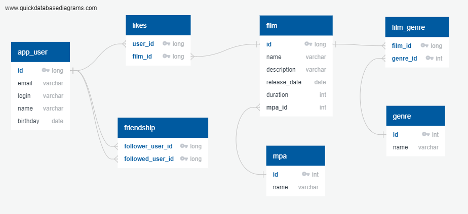

# Проект FILMORATE
## Создание backend-части приложения по оценке и выбору фильмов для просмотра

Приложение обрабатывает внешние http-запросы:
* создание фильмов и пользователей;
* обновление фильмов и пользователей;
* пользователь ставит лайк фильму и удаляет лайк;
* пользователь добавляет другого пользователя в друзья и удаляет из друзей;
* получение списка фильмов и списка пользователей;
* получение списка самых популярных фильмов.

ER-диаграмма базы данных приложения:



На текущий момент такая база данных позволяет хранить и обрабатывать все предусмотренные техническим заданием запросы.

Связи *многие-ко-многим* между сущностями реализованы посредством промежуточных таблиц,
в которых пара первичных ключей таких сущностей образует составной первичный ключ таблицы.
Например, у фильма может быть не один жанр и любой жанр может быть у многих фильмов.
Например, следующий SQL-запрос вернет перечень фильмов с рейтингом "PG".
```
SELECT f.name
FROM film f
INNER JOIN film_genre fg ON f.film_id=fg.film_id
INNER JOIN genre g ON fg.genre_id=g.genre_id
WHERE g.name='PG'
```

Таблица likes организована по такому же принципу, но содержит информацию о том, каким пользователям
нравятся какие-либо фильмы.

Таблица friendship содержит идентификаторы пользователей, подавших заявку (follower_user_id) на добавление другого
пользователя (followed_user_id) в друзья. Подтверждением запроса дружбы будет считаться добавление в таблицу записи
с идентификаторами, в которой пользователь принимающий заявку будет добавлен в столбец follower_user_id, а пользователь
подавший заявку в столбец followed_user_id.