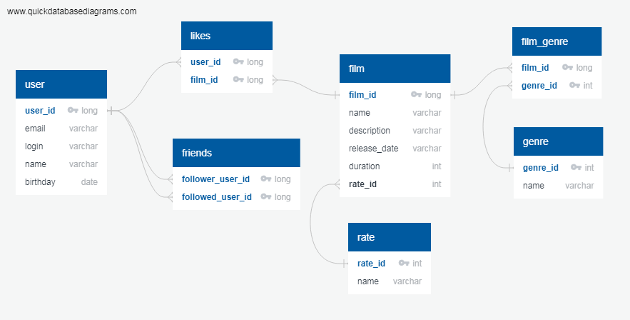

# Проект FILMORATE
## Создание backend-части приложения по оценке и выбору фильмов для просмотра  
Сегодня, ребятки, мы с вами попробуем заполнить файл readme.md.

Приложение обрабатывает внешние http-запросы:
* создание фильмов и пользователей;
* обновление фильмов и пользователей;
* пользователь ставит лайк фильму и удаляет лайк;
* пользователь добавляет другого пользователя в друзья и удаляет из друзей;
* получение списка фильмов и списка пользователей;
* получение списка самых популярных фильмов.

ER-диаграмма базы данных:

1

2

3

4

